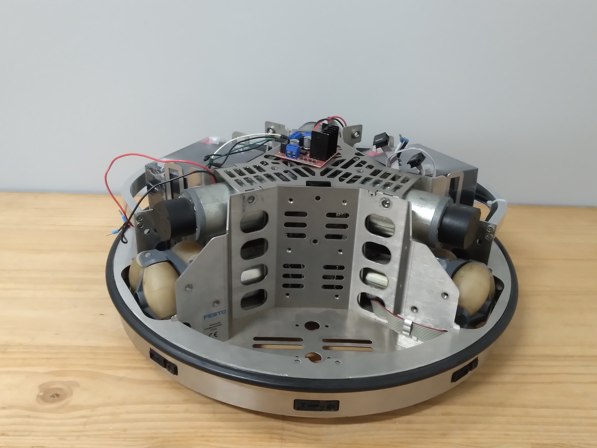

# R.A.S
## 1 Identificação
PROJETO CRIADO EM <b> MARÇO DE 2025. </b>  
Esse é o repositório do Robo <b> R.A.S (Robo autonomo de Serviços) </b> construido para um Projeto de TCC do <b> IFPR Pinhais.</b>    
Orientado pelo Professor <b> Marlon de Oliveira Vaz. </b>  

Orientados:  
- <strong> Gustavo Rocha</strong>, qual terá a responsabilidade da parte eletrica e mecanica do robô.  
- <strong> Guilherme Macanhan</strong>, cuidara da parte de programação e calculos.  
- <b> Nicolas Vaz</b>, junto ao Macanhan irá fazer a parte de programação.  

### Identificação Visual do projeto

## 2 Introdução
### Descrição da Visão geral do Projeto:
O robô autônomo de serviços (R.A.S) é um sistema móvel projetado para atuar em ambientes internos, com capacidade de mobilidade autônoma e interação por voz. O projeto utiliza sensores e câmeras de mapeamento para desvios de obstáculos, e um raspberry pi 4 como unidade de processamento, e será programado na linguagem python.

### Público Alvo:
 Nosso público alvo será nosso próprio orientador, <b> Marlon Vaz. </b>

### Objetivo do projeto:
O projeto tem como principal objetivo atender as demandas de serviços em ambientes internos.

## Escopo do produto
### Descrição do produto (MVP):
Nosso mvp do projeto será um simulador em python que simulará um ambiente com obstáculos no qual o robô será testado para analisar a eficácia do código de cálculos para desvios de objetos, o simulador não levará em consideração informações da estrutura do robô, como por exemplo o peso e velocidade.

### Principais entregas:
- 1 - A estrutura física do robô.
- 2 - O código para cálculos de desvios e mapeamento de ambiente.

### Critérios de Aceite:
#### Itens qualitativos:
 - O robô deve atender corretamente a comandos de voz.
 - O robô deve desviar dos obstáculos presentes no ambiente.
 - O botão de parada bruta do robô deve desligar o sistema por completo instantaneamente.
 - O robô deve ser capaz de se locomover pelo ambiente de forma autônoma.

#### Itens quantitativos:
 - O robô deve ter pelo menos duas baterias.
 - O robô deve ter um micro-computador, de preferência o raspberry pi 4.
 - O robô deve ter câmeras e sensores para mapeamento do ambiente.
 - O robô deve ter 3 rodas omnidirecionais e 1 motor de controle para cada roda, totalizando 3 motores.
 - O robô deve ter uma estrutura metálica adequada à base do projeto.

### Matriz de Riscos:

<table border="1">
<tr>
 <th>ID Riscos</th>
 <th>Descrição do Risco</th>
 <th>Probabilidade</th>
 <th>Impacto</th>
 <th>Plano de Resposta</th>
 <th>Status do Risco</th>
</tr>
<tr>
 <td>1</td>
 <td>Robô andar descontroladamente pelo ambiente</td>
 <td>Baixa</td>
 <td>Alto</td>
 <td>Botão de parada bruta que desligará o sistema por completo assim que acionado</td>
 <td>Nunca ocorrido</td>
</tr>
<tr>
 <td>2</td>
 <td>Superaquecimento do Raspberry Pi ou motores</td>
 <td>Média</td>
 <td>Médio</td>
 <td>Monitoramento da temperatura e desligamento automático em caso de temperatura crítica</td>
 <td>Nunca ocorrido</td>
</tr>
<tr>
 <td>3</td>
 <td>Curto-circuito nos componentes eletrônicos</td>
 <td>Baixa</td>
 <td>Alto</td>
 <td>Uso de fusíveis, proteção contra sobrecorrente e carcaça isolante</td>
 <td>Nunca ocorrido</td>
</tr>
<tr>
 <td>4</td>
 <td>Falha de comunicação entre sensores e o Raspberry Pi</td>
 <td>Média</td>
 <td>Médio</td>
 <td>Função que reinicia o sistema de sensores automaticamente</td>
 <td>Nunca ocorrido</td>
</tr>
<tr>
 <td>5</td>
 <td>Falta de energia durante a operação</td>
 <td>Média</td>
 <td>Alto</td>
 <td>Implementação de sistema beep para aviso de falhas</td>
 <td>Nunca ocorrido</td>
</tr>
<tr>
 <td>6</td>
 <td>Erro de reconhecimento de comando de voz</td>
 <td>Média</td>
 <td>Baixo</td>
 <td>Repetição do comando com feedback de voz solicitando nova tentativa</td>
 <td>Nunca ocorrido</td>
</tr>
<tr>
 <td>7</td>
 <td>Obstáculo não detectado em tempo hábil</td>
 <td>Baixa</td>
 <td>Alto</td>
 <td>Dupla redundância de sensores e atualização em tempo real do mapeamento</td>
 <td>Falha ocorrida em simulador</td>
</tr>
</table>

